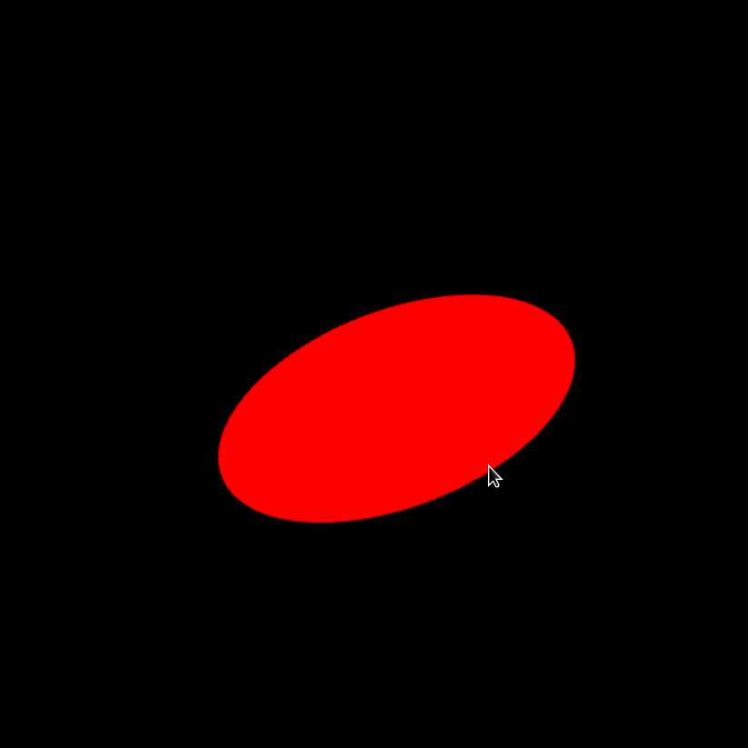
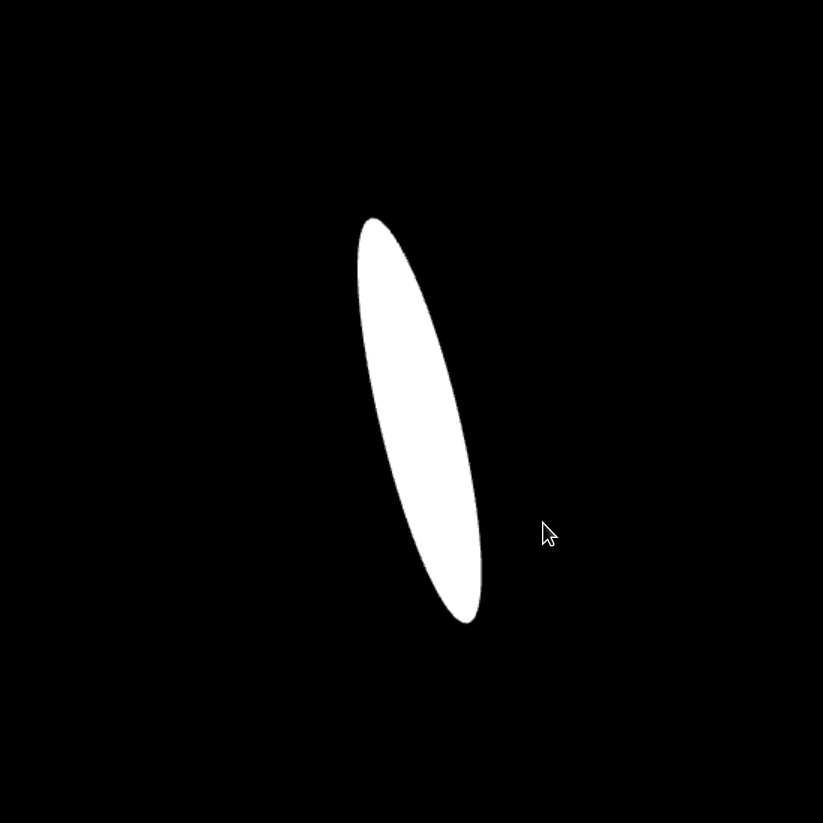
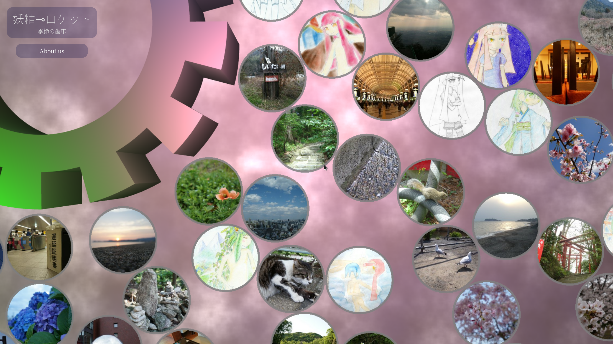

# パースのついた円とマウスの当たり判定をする

Object Picking without additional shaders.

## 説明

3Dでゴリゴリ動かしてる板ポリの上に描いた丸と、画面上のマウスカーソルとの当たり判定をした時に使った技術をサンプル化しました。

## Sample Page

https://ledyba.github.io/__sample__3d-picking-without-shaders/index.html

## Screenshot

## 解説

ブログ記事があります：

[パースのついた円とマウスの当たり判定をする | 月と燃素と、ひと匙の砂糖](https://7io.org/2020/04/09/09:57:24/)

## 実用例

[妖精⊸ロケット :: the gear of seasons](https://hexe.net/)

このサイトでのマウスホバーと、クリックの判定を実現するために使っています。